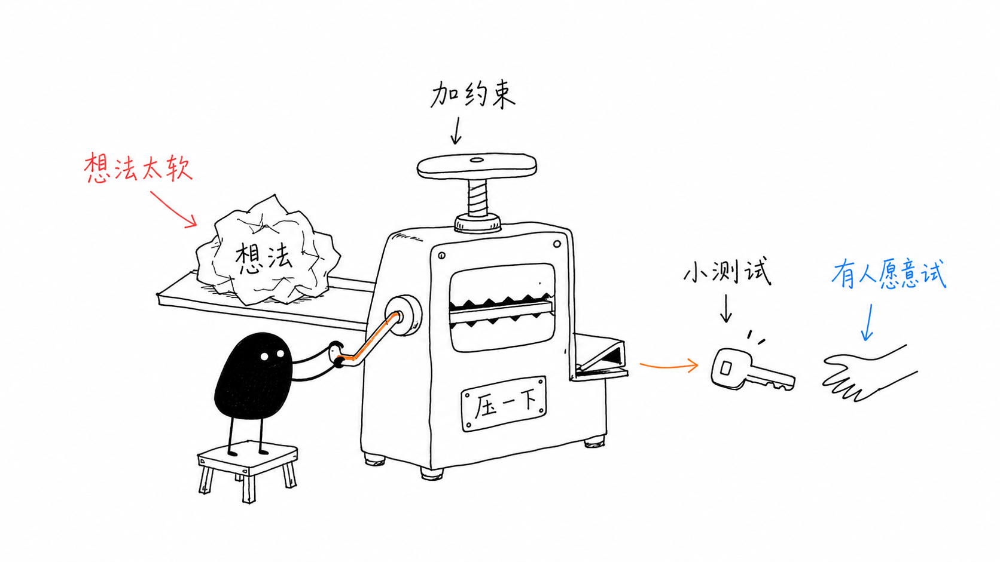
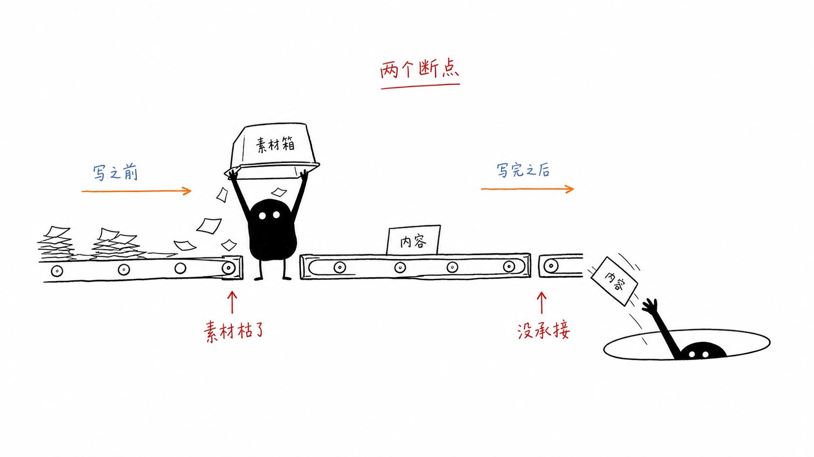
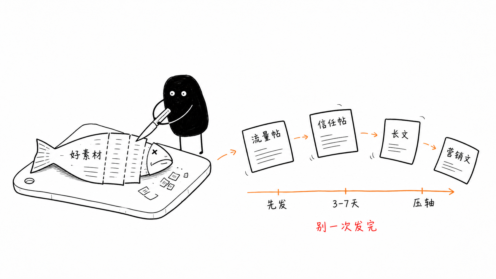
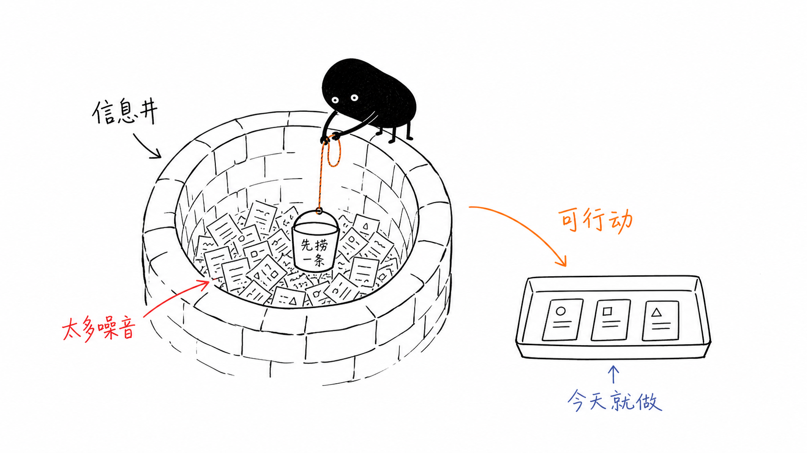
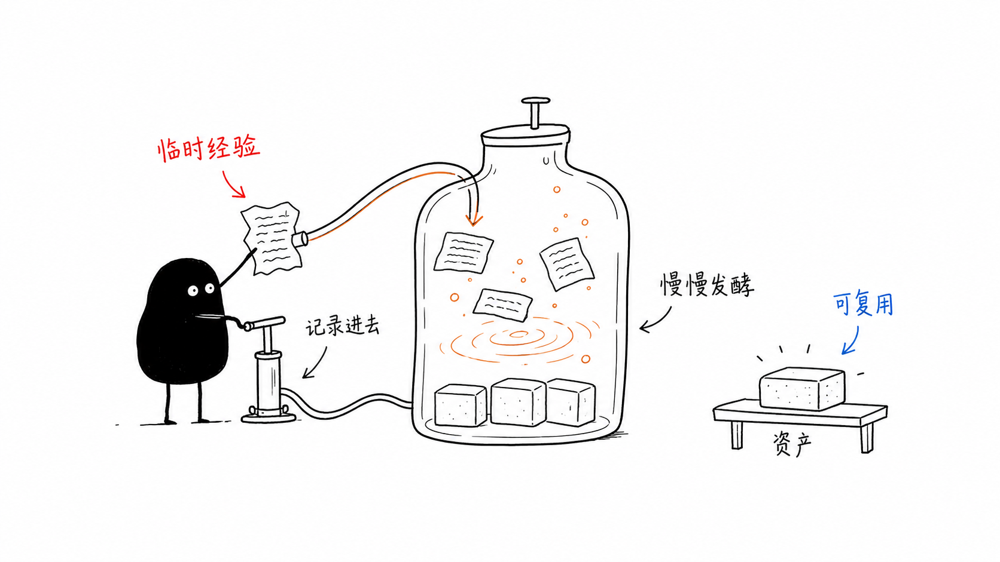
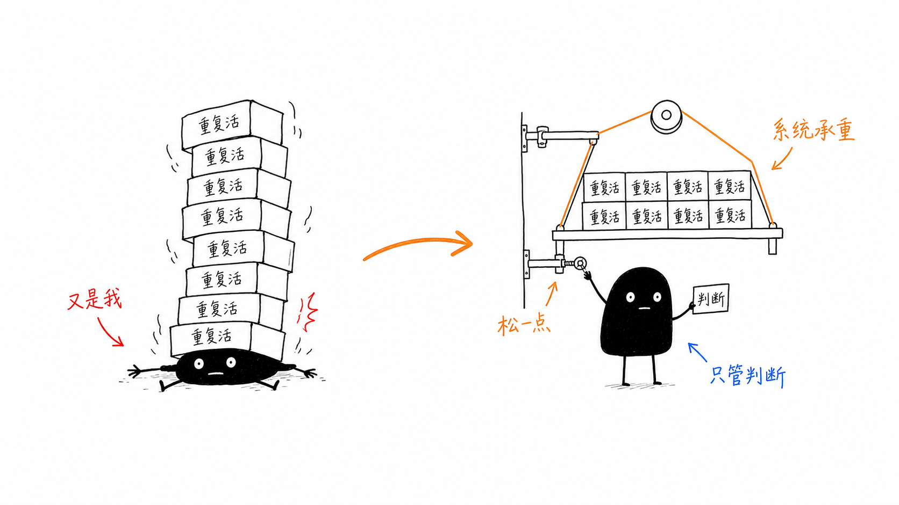
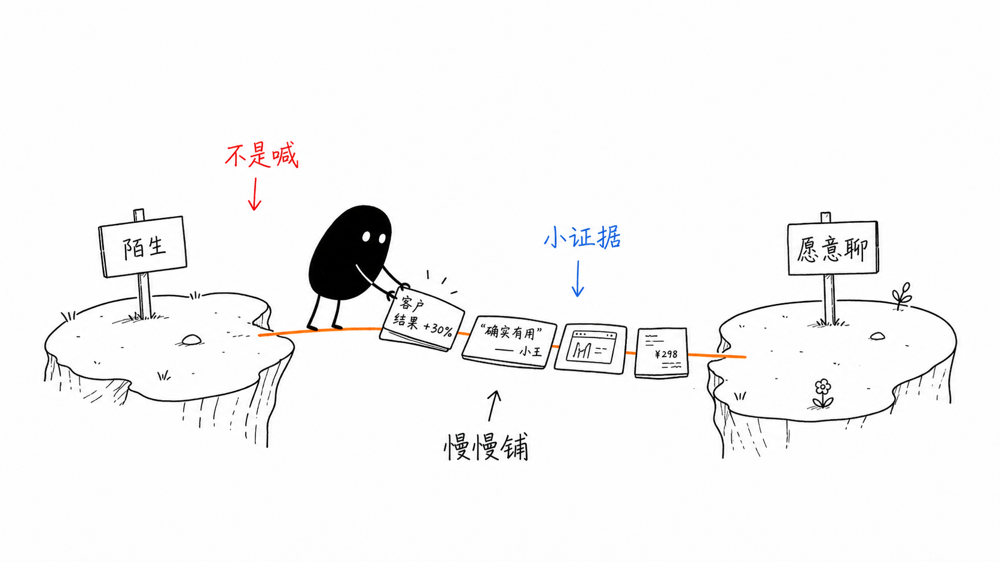

<div align="center">

# Editorial IP Visuals

### Ian 小黑怪诞正文配图 Skill

把中文文章里的观点、流程、结构与隐喻，转译成清爽、怪诞、有记忆点的 16:9 手绘正文配图。


</div>

<p align="center">
  
</p>

## 这是什么

`ian-xiaohei-illustrations` 是一个面向中文内容创作者的 Codex Skill。它会先理解文章，而不是直接堆砌装饰；再把核心判断、认知转折、输入输出、分流关系或抽象隐喻，变成一组能嵌入正文的原创插图。

默认视觉 IP 是「小黑」：黑色实心身体、白点眼睛、细腿和一张冷静的空表情脸。小黑会认真完成一件荒诞但逻辑成立的事，并始终参与画面的核心动作。

### 视觉特点

| 清爽留白 | 怪诞隐喻 | 中文批注 | 正文友好 |
| --- | --- | --- | --- |
| 纯白背景与黑色手绘线稿 | 用奇怪但成立的动作解释抽象概念 | 少量红、橙、蓝手写标注 | 默认 16:9，适合博客、帖子与 Notion |

它不是商业插画模板，也不是 PPT 流程图生成器。每张图只讲一个核心结构，并从当前文章重新发明隐喻。

## 示例画廊

| 两个断点 | 一鱼多吃 |
| --- | --- |
|  |  |

| 信息井 | 内容发酵 |
| --- | --- |
|  |  |

| 系统承接 | 信任桥梁 |
| --- | --- |
|  |  |

更多视觉样例见 [`assets/examples/`](assets/examples/)。示例只用于校准风格密度，不会在新任务中照抄构图。

## 适合什么内容

- 中文公众号、博客、长帖和知识型内容
- Notion 文档、方法论、工作流和项目复盘
- 产品观点、内容策略、组织协作和系统思考
- 需要把抽象判断变成视觉隐喻的正文段落
- 已有配图需要去标题、减信息或统一为小黑风格

## 安装

将仓库克隆到个人 Codex Skills 目录：

```bash
git clone https://github.com/zaoshangduziteng/Editorial-IP-Visuals.git \
  ~/.codex/skills/ian-xiaohei-illustrations
```

重新打开 Codex 任务后，即可通过 `$ian-xiaohei-illustrations` 调用。

## 如何使用

### 1. 为整篇文章设计并生成配图

上传文章、Markdown 文件或粘贴正文，然后说：

```text
使用 $ian-xiaohei-illustrations，为这篇文章设计并生成一组小黑怪诞正文配图。
```

Skill 会自动选择真正需要配图的认知锚点，默认生成 4–8 张，不会平均给每个段落塞图。

### 2. 先要配图策略，不立即生成

```text
使用 $ian-xiaohei-illustrations，分析这篇文章哪里需要配图，先给我 shot list。
```

每张候选图会说明放置段落、核心意思、结构类型、小黑动作、建议元素和中文标注词。

### 3. 只生成一张图

```text
使用 $ian-xiaohei-illustrations，把“内容在多个平台被重新加工”画成一张 16:9 小黑正文配图。
```

也可以继续提出局部要求：

```text
去掉标题，减少文字，让小黑成为核心动作主体，保留纯白背景。
```

## 工作方式

```text
消化正文 → 找认知锚点 → 设计原创隐喻 → 单张生成 → 风格与文字检查 → 保存交付
```

生成后的图片会优先保存到当前工作区：

```text
assets/<article-slug>-illustrations/
├── 01-topic-name.png
├── 02-topic-name.png
└── ...
```

## 风格守则

- 小黑必须参与核心动作，不能站在旁边当装饰。
- 保持纯白背景、黑色手绘线稿和大量留白。
- 只使用少量红、橙、蓝中文手写批注。
- 避免商业插画、可爱卡通、复杂架构图和 PPT 感。
- 不在左上角添加「流程图」「常见坑」等类型标题。
- 不复刻历史案例；每次从当前内容重新设计隐喻。

## 项目结构

```text
Editorial-IP-Visuals/
├── SKILL.md
├── agents/
│   └── openai.yaml
├── assets/
│   └── examples/
└── references/
    ├── composition-patterns.md
    ├── prompt-template.md
    ├── qa-checklist.md
    ├── style-dna.md
    └── xiaohei-ip.md
```

`SKILL.md` 定义完整工作流；`references/` 保存风格 DNA、小黑 IP 规范、构图方法、提示词模板与质量检查；`assets/examples/` 提供低频视觉校准样例。

---

<p align="center">让小黑认真处理那些很难画清楚的事。</p>
