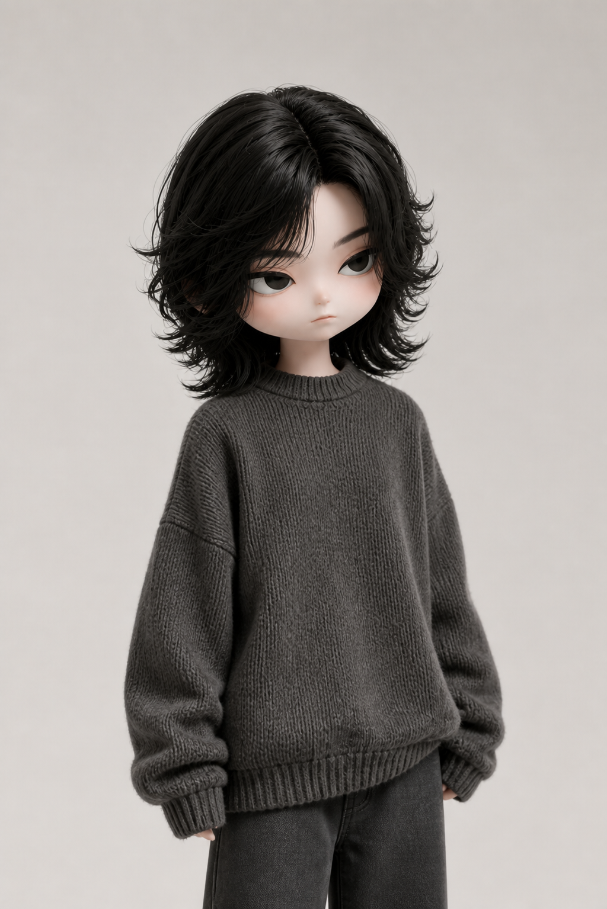
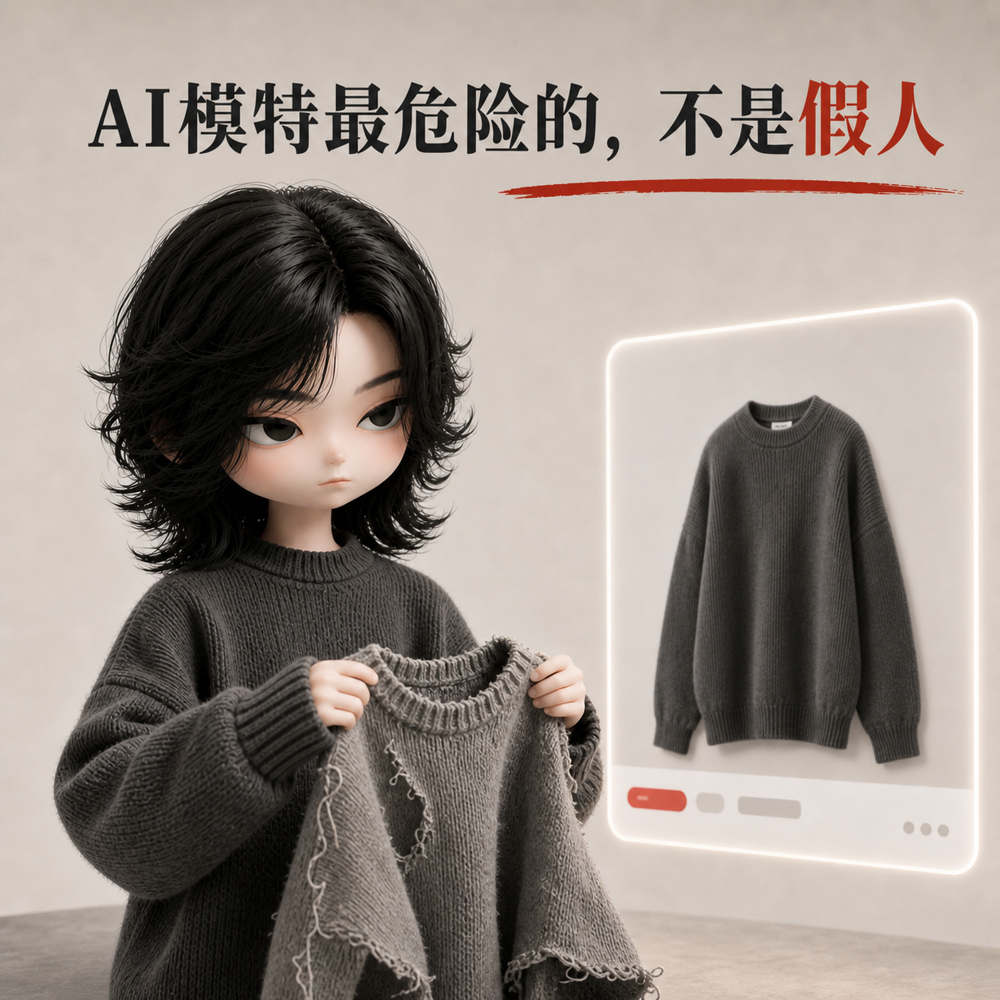
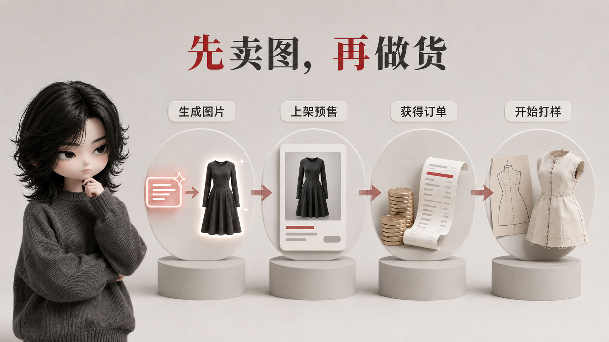
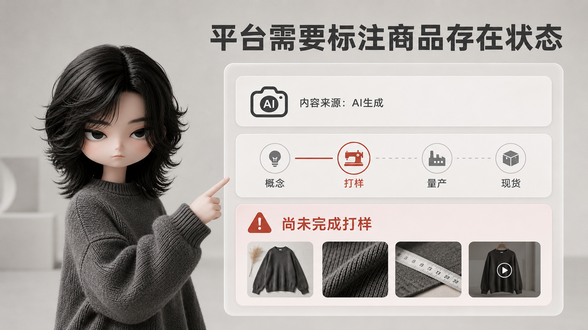

<div align="center">

# Editorial IP Visuals

### 固定 IP × 3D 编辑型文章配图系统

把中文文章中的核心观点、机制、风险与解决方案，转成一套风格统一、能解释论证的视觉资产。


</div>

<p align="center">
  
</p>

## 这是什么

`editorial-ip-visuals` 是一个面向中文内容创作者的 Codex Skill。它先理解文章的论证，再使用固定 3D IP、灰白编辑空间、真实材质、黑色大标题与克制的砖红强调，为文章建立统一视觉系统。

默认交付：

- 1 张公众号横版封面
- 1 张 1:1 缩略图
- 3–4 张 16:9 正文论证配图
- 一份“图片—用途—原文具体插入句子”定位表

正文图必须承担解释任务，而不是只做装饰；封面与缩略图负责建立冲突和识别度。

## 固定视觉 DNA

| 角色 | 空间 | 材质 | 信息层级 |
| --- | --- | --- | --- |
| 冷淡、疲惫的大头 3D 玩偶 IP | 暖灰或冷灰的编辑摄影棚 | 针织、纸张、金属、木材与磨砂玻璃 | 深色中文标题 + 单一砖红警示色 |

<p align="center">
  
</p>

角色身份固定，但文章场景、道具、物理动作和信息结构会重新设计。示例只约束媒介、光线、材质、留白与标题气质，不作为改字模板。

## 示例资产

| 横版封面 | 1:1 缩略图 |
| --- | --- |
|  |  |

| 顺序逆转 | 风险转移 |
| --- | --- |
|  |  |

| 标签遮蔽 | 产品状态 |
| --- | --- |
|  |  |

## 适用场景

- 公众号、人人都是产品经理、博客与知识型长文
- 一篇文章需要封面、缩略图和正文图整套统一
- 观点、流程、风险、机制或方案需要被视觉化解释
- 需要保持固定 IP 角色跨文章一致
- 只做 shot list、单张改图或整套视觉改版
- 使用公开帖子截图作为证据，并完成必要脱敏

## 安装

克隆到个人 Codex Skills 目录：

```bash
git clone https://github.com/zaoshangduziteng/Editorial-IP-Visuals.git \
  ~/.codex/skills/editorial-ip-visuals
```

重新打开 Codex 任务后，即可通过 `$editorial-ip-visuals` 调用。

## 如何使用

### 生成完整套图

上传或粘贴文章全文，然后说：

```text
使用 $editorial-ip-visuals，为这篇公众号文章制作横版封面、1:1 缩略图和正文论证配图，并标出每张图的具体插入位置。
```

### 只做规划

```text
使用 $editorial-ip-visuals，先分析这篇文章并输出 shot list，不生成图片。
```

### 使用新 IP

上传角色参考图后说：

```text
使用 $editorial-ip-visuals，沿用这张新 IP 的身份特征，为文章制作整套视觉；不要覆盖技能内置 IP。
```

### 混合原创图与证据截图

```text
使用 $editorial-ip-visuals：封面和概念图原创，正文局部使用公开帖子截图；保留来源链接并脱敏头像、昵称和账号信息。
```

### 修改已有图片

```text
使用 $editorial-ip-visuals，只修正这张图的标题。保持 IP、构图、材质、比例和其他正确文字不变。
```

## 工作模式

1. **只做规划**：分析文章并输出 shot list。
2. **原创配图**：使用固定 IP 生成完整套图；这是默认模式。
3. **截图证据**：检索公开帖子，仅做必要裁切与脱敏。
4. **混合模式**：原创封面与概念图，加少量脱敏证据截图。
5. **改图模式**：修改既有资产，同时锁定必须保持不变的元素。

## 工作流程

```text
收集输入 → 消化文章 → 定义视觉母题 → Shot list → 逐张生成 → QA → 定位交付
```

正文图会绑定一条原文完整句子。最终交付不会只写“第二章后”，而会给出可直接搜索定位的原句。

## 质量边界

- 一张图只解释一个认知锚点。
- IP 参与核心动作，但不能遮住主要信息。
- 正文图不能退化成通用 PPT、扁平流程图或装饰壁纸。
- 图中文字保持短、少、准确；错字优先定向修复。
- 方形缩略图重新构图，不能机械裁切横版封面。
- 不伪造帖子、评论、点赞数或“买家秀”。
- 不复刻样例标题、道具组合或完整构图。

## 项目结构

```text
Editorial-IP-Visuals/
├── SKILL.md
├── agents/
│   └── openai.yaml
├── assets/
│   ├── default-ip-reference.png
│   ├── icon.svg
│   └── examples/
└── references/
    ├── composition-patterns.md
    ├── ip-character.md
    ├── platform-specs.md
    ├── prompt-templates.md
    ├── qa-checklist.md
    ├── screenshot-evidence.md
    ├── style-examples.md
    └── visual-dna.md
```

`SKILL.md` 定义完整执行流程；`references/` 保存视觉 DNA、角色规范、平台比例、构图模式、提示词和质检规则；`assets/` 提供默认 IP 与低频风格校准样例。

---

<p align="center">先让读者看懂观点，再让他们记住风格与 IP。</p>
